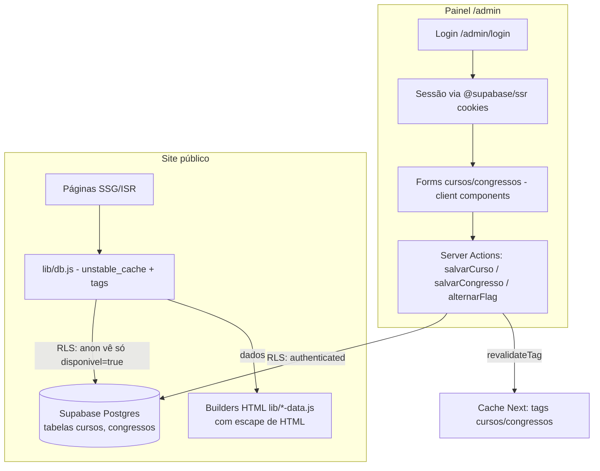

# Painel Administrativo — Design

**Spec**: `.specs/features/painel-adm/spec.md`
**Status**: Draft

---

## Abordagens consideradas

**A. ISR com tags (recomendada)** — Páginas públicas continuam estáticas; leituras do banco passam por `unstable_cache` com tags (`cursos`, `congressos`); as server actions do painel chamam `revalidateTag` após cada escrita. Publicação em segundos, site continua servindo versão stale se o banco cair durante a regeneração, custo de função quase zero.

**B. SSR dinâmico com cache curto** — Páginas viram dinâmicas com cache de 60s. Mais simples de raciocinar, porém toda requisição passa por função, perde-se a natureza estática do site e a resiliência fica dependente do cache de fetch.

**Escolha: A** — preserva a arquitetura SSG atual (AD-001..005 conformes) e atende ADM-08/09 diretamente.

---

## Architecture Overview



Fluxo de publicação: salvar → grava no Postgres → `revalidateTag('cursos'|'congressos')` → próxima visita regenera a página (≤ segundos). Falha do banco na regeneração → Next mantém a última versão gerada (stale) → ADM-09.

---

## Code Reuse Analysis

| Component | Location | How to Use |
| --- | --- | --- |
| Builders de HTML (`cursoHtml`, `congressoHtml`, `congressosPage`, card de agenda) | `lib/cursos-data.js`, `lib/congressos-data.js` | Parametrizar: recebem o objeto do banco em vez de ler o mapa estático. Mapas atuais viram apenas seed |
| Seções dinâmicas de `home`/`cursos` | `lib/content.js` | Extrair carrossel de turmas e fileiras do catálogo para builders `turmasHtml(cursos)` / `catalogoHtml(cursos)`; o restante do markup permanece string estática |
| `Screen`, `useSiteHandlers`, `data-href` | `components/` | Painel reutiliza design system, mas usa React normal (sem `dangerouslySetInnerHTML`) |
| Guard rails | `scripts/check-guardrails.mjs` | Passa a escanear também `app/admin/**`; paleta/copy valem para o painel |
| Design system (paleta, pills, `data-hv`) | `app/base.css`, CLAUDE.md | Painel usa os mesmos tokens |

### Integration Points

| System | Integration Method |
| --- | --- |
| Supabase (novo projeto `grupoclg`, org `skbuagugttpvmlxyklqn`, custo confirmado US$ 0/mês) | `@supabase/supabase-js` + `@supabase/ssr`; env `NEXT_PUBLIC_SUPABASE_URL` + `NEXT_PUBLIC_SUPABASE_ANON_KEY` |
| Vercel | Env vars no projeto; nenhuma mudança de build |

---

## Components

### Data layer — `lib/db.js`

- **Purpose**: única porta de leitura do conteúdo dinâmico, com cache por tag.
- **Interfaces**: `getCursos()`, `getCurso(slug)`, `getCongressos()`, `getCongresso(slug)` — todas via `unstable_cache(..., { tags: ['cursos'|'congressos'], revalidate: 3600 })`; retornam apenas `disponivel=true` (RLS anon já garante).
- **Dependencies**: `lib/supabase/server.js` (client anon).
- **Reuses**: tipos/shape idênticos aos mapas atuais.

### Supabase clients — `lib/supabase/{server,client,middleware}.js`

- **Purpose**: criação de clients conforme contexto (RSC/actions com cookies, browser, middleware de refresh), padrão oficial `@supabase/ssr`.
- **Interfaces**: `createClient()` por contexto; `updateSession(request)` no middleware (só rotas `/admin`).

### Server Actions — `app/admin/actions.js`

- **Purpose**: todas as escritas do painel.
- **Interfaces**: `salvarCurso(formData)`, `salvarCongresso(formData)`, `alternarDisponivel(tipo, id, valor)`.
- **Regras**: (1) exige sessão (`getUser()`), senão erro de auth — ADM-02; (2) valida obrigatórios/limites/ISO — ADM-04; (3) slug: gerado na criação (`slugify(titulo)` + sufixo `-2`, `-3`… se colidir), imutável na edição; (4) upsert por `id`; (5) `revalidateTag` + `revalidatePath('/cursos/[slug]')` do item — ADM-08.

### Painel UI — `app/admin/**`

- **Purpose**: telas do cliente.
- **Location**: `app/admin/layout.jsx` (guarda de sessão + navegação), `app/admin/login/page.jsx`, `app/admin/page.jsx` (visão geral), `app/admin/cursos/page.jsx` (lista), `app/admin/cursos/[id]/page.jsx` (form, `novo` = sem id), idem `congressos`.
- **Detalhes**: client components controlados (sem lib de formulário); editor de listas (bullets/programa/dias) com adicionar/remover/reordenar — ADM-11; botão desabilitado durante envio; toast "Salvo · já no site"; badge "fora do site" para `disponivel=false`. Lista do painel usa client autenticado (vê tudo).

### Builders parametrizados — `lib/cursos-data.js` / `lib/congressos-data.js` / `lib/content.js`

- **Purpose**: gerar o HTML público a partir de dados do banco, com **escape obrigatório** de todo campo interpolado (`escapeHtml()` — o conteúdo agora é editável pelo cliente e entra via `dangerouslySetInnerHTML`).
- **Interfaces**: `cursoHtml(curso)`, `congressoHtml(congresso)`, `congressosPageHtml(congressos)`, `homeHtml(cursos)`, `cursosPageHtml(cursos)`.
- **Detalhes**: catálogo agrupa por `cat` com mapa de ícones por categoria (ícone padrão para categoria nova); fileiras/carrossel omitidos quando vazios (edge cases da spec); páginas de detalhe com `dynamicParams = true` (slug novo renderiza on-demand) e `notFound()` quando indisponível — ADM-07.

### Seed — `scripts/seed.mjs` + migration SQL

- **Purpose**: criar tabelas/RLS (migration via MCP `apply_migration`) e semear com os mapas atuais — ADM-10.

---

## Data Models

Colunas = chaves dos objetos JS atuais (zero mapeamento), exceto `desc` → `descricao`.

```sql
create table cursos (
  id uuid primary key default gen_random_uuid(),
  slug text unique not null,
  title text not null,
  cat text not null,
  tag text not null default 'Curso',
  nivel text, modulos text, horas text,
  descricao text not null,
  bullets jsonb not null default '[]',
  poster text not null,
  inscricoes text, inicio text, vagas text,
  programa jsonb not null default '[]',      -- [{t, d}]
  disponivel boolean not null default true,
  created_at timestamptz not null default now(),
  updated_at timestamptz not null default now()
);

create table congressos (
  id uuid primary key default gen_random_uuid(),
  slug text unique not null,
  nome text not null,
  edicao text not null,
  tagline text,
  datas text not null,
  iso date not null,
  card_dias text, card_mes text, card_local text, card_desc text,
  status text not null default 'Inscrições abertas',
  local_chip text, formato text, sobre text,
  stats jsonb not null default '{}',          -- {dias, paineis, workshops, publico}
  local_nome text, local_desc text,
  prog jsonb not null default '[]',           -- [{dia, titulo, itens[]}]
  disponivel boolean not null default true,
  created_at timestamptz not null default now(),
  updated_at timestamptz not null default now()
);
```

**RLS (ambas as tabelas):**

- `select` para `anon`: `using (disponivel = true)` — site só vê publicados.
- `select` para `authenticated`: `using (true)` — painel vê tudo.
- `insert`/`update` para `authenticated`: `with check (true)`.
- Sem policy de `delete` — AD-003 garantido no banco, não só na UI.
- Trigger `updated_at = now()` em update.

---

## Error Handling Strategy

| Error Scenario | Handling | User Impact |
| --- | --- | --- |
| Credenciais inválidas | Mensagem única "E-mail ou senha incorretos" | Sem vazamento de qual campo errou |
| Escrita sem sessão (inclusive chamada direta) | Action retorna erro de auth; RLS bloqueia no banco (defesa dupla) | "Sessão expirada, entre novamente"; formulário preservado |
| Falha de rede/banco no salvar | Action retorna `{ ok:false, error }`; form mantém estado | Erro visível, nada perdido |
| Banco fora na regeneração ISR | `unstable_cache` lança; Next serve página stale | Visitante vê última versão |
| Slug duplicado | Sufixo numérico automático | Salva sem erro |
| ISO inválida / obrigatório faltando / limite excedido | Validação na action antes do banco | Campos apontados no form |

---

## Risks & Concerns

| Concern | Location | Impact | Mitigation |
| --- | --- | --- | --- |
| **XSS**: conteúdo passa a ser editável e entra via `dangerouslySetInnerHTML` | builders em `lib/*-data.js` | Injeção de script no site público | `escapeHtml()` obrigatório em toda interpolação (edge case da spec); teste dedicado com `<script>` no título |
| Seções hardcoded de `home`/`cursos` em strings | `lib/content.js` (turmas ~l.300, catálogo ~l.460) | Conteúdo do banco não refletiria na home/catálogo | Extração para builders parametrizados (tarefa própria) |
| Acoplamento `[style*=]` | `app/base.css` × builders | Valores novos quebram mobile silenciosamente | Reutilizar exatamente os estilos inline atuais; guard rails acusam órfãos |
| `generateStaticParams` estático hoje | `app/*/[slug]/page.jsx` | Curso novo criado no painel daria 404 | `export const dynamicParams = true` + ISR on-demand |
| Projeto Supabase free pausa por inatividade | Supabase free tier | Painel indisponível até restaurar | Aceito para o porte do site; site público segue no ar (stale). Upgrade é decisão futura do cliente |
| Sem testes no repositório | raiz | ACs sem gate automatizado | Introduzir Vitest mínimo para actions/builders (validação, slug, escape, filtro disponivel) |

---

## Tech Decisions

| Decision | Choice | Rationale |
| --- | --- | --- |
| Cache/publicação | `unstable_cache` + `revalidateTag` (tags `cursos`/`congressos`) | ADM-08/09 com mínimo de infraestrutura |
| Escrita com RLS (sem service key) | Actions usam client com sessão do usuário | Defesa em profundidade; nenhum segredo além do anon key |
| Colunas = chaves JS | `title`, `cat`, `nivel`… (`desc`→`descricao`) | Builders atuais funcionam quase sem mapeamento |
| Formulários | Controlados, sem biblioteca | 2 forms; dependência não se justifica |
| Testes | Vitest (unit: validação/slug/escape/builders) | Gate objetivo para os ACs críticos |
| Painel fora dos padrões `content.js` | React/JSX direto | Painel não precisa de SSG nem do runtime de strings |

> Projeto-nível (novo AD): **AD-006 — Todo campo vindo do banco é escapado (`escapeHtml`) antes de entrar em template HTML.** Registrar no STATE.md ao aprovar o design.
